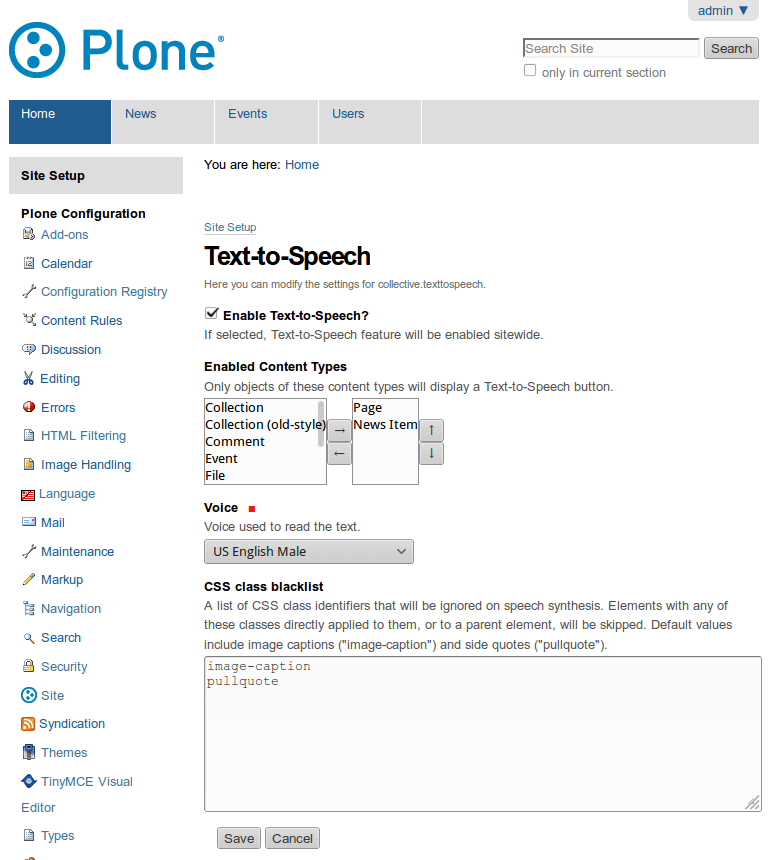

**************
Text-to-Speech
**************

.. contents:: Table of Contents

Life, the Universe, and Everything
==================================

This package enables a Text-to-Speech feature in Plone.

It is currently based on `ResponsiveVoice <http://responsivevoice.org/>`_,
an HTML5-based Text-To-Speech library designed to add voice features to web sites across multiple plataforms.

ResponsiveVoice supports 51 languages through 168 voices and is free for non-commercial use.

Mostly Harmless
===============

.. image:: http://img.shields.io/pypi/v/collective.texttospeech.svg
   :target: https://pypi.python.org/pypi/collective.texttospeech

.. image:: https://img.shields.io/travis/simplesconsultoria/collective.texttospeech/master.svg
    :target: http://travis-ci.org/simplesconsultoria/collective.texttospeech

.. image:: https://img.shields.io/coveralls/simplesconsultoria/collective.texttospeech/master.svg
    :target: https://coveralls.io/r/simplesconsultoria/collective.texttospeech

Got an idea? Found a bug? Let us know by `opening a support <https://github.com/simplesconsultoria/collective.texttospeech/issues>`_.

Don't Panic
===========

Installation
------------

To enable this package in a buildout-based installation:

#. Edit your buildout.cfg and add add the following to it:

.. code-block:: ini

    [buildout]
    ...
    eggs =
        collective.texttospeech

After updating the configuration you need to run ''bin/buildout'', which will take care of updating your system.

Go to the 'Site Setup' page in a Plone site and click on the 'Add-ons' link.

Check the box next to ``collective.texttospeech`` and click the 'Activate' button.

Usage
-----

After installing the package, go to the Text-To-Speech configlet on Site Setup.

Select which content types will have the feature enabled and select which voice will be used.

    The Text-To-Speech control panel configlet.

A viewlet with a 'Play' button will be displayed on objects with the feature enabled.

.. figure:: docs/viewlet.png
    :align: center
    :height: 400px
    :width: 768px

    The Text-To-Speech feature enabled.

You can pause the reader at any time by selecting 'Pause'.
